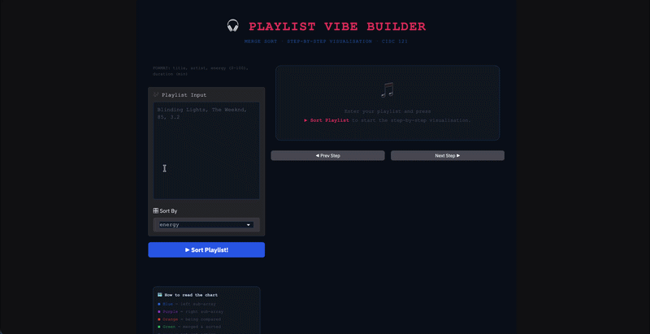
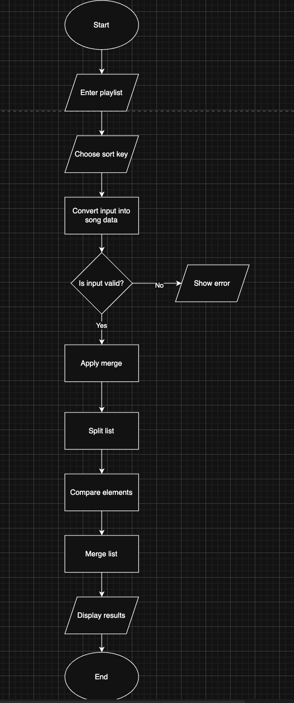
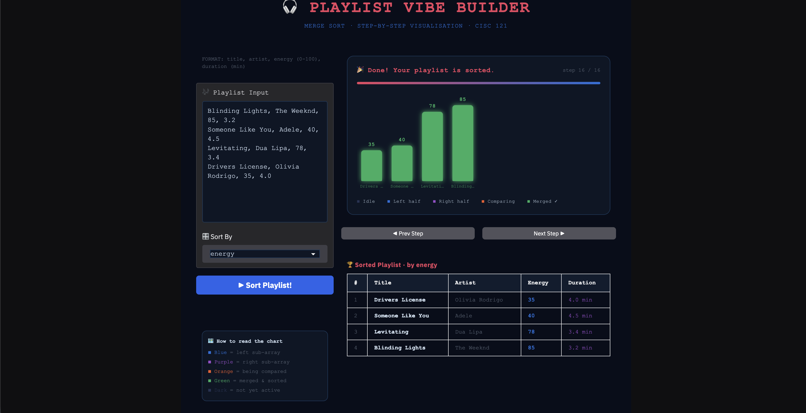
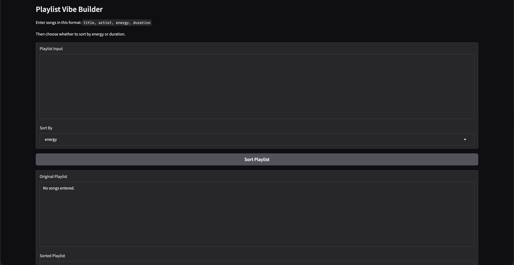
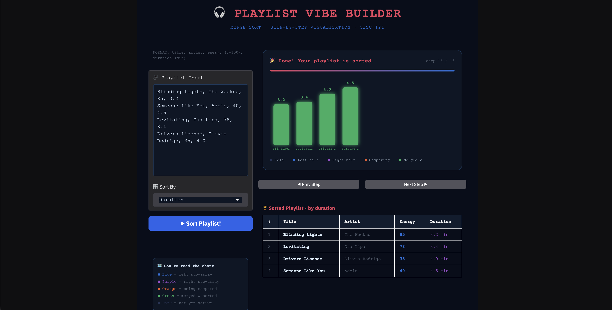

# Playlist Vibe Builder

## Chosen Problem

This app solves the Playlist Vibe Builder problem by sorting songs based on energy or duration. It helps users organize a playlist depending on the mood or length they want.

## Chosen Algorithm

I chose Merge Sort because it is efficient and easy to visualize each step. It works well for sorting a list of songs because the playlist can be split into smaller parts, sorted, and then merged back together.

## Demo

## Problem Breakdown & Computational Thinking

### Decomposition

- Read playlist input
- Convert each line into a song record
- Choose sorting key
- Apply merge sort
- Show sorted results and sorting steps

### Pattern Recognition

- The algorithm repeatedly splits the list into halves
- It repeatedly compares values from two smaller lists
- It repeatedly merges items back in sorted order

### Abstraction

- The focus is on how songs move into order
- The app shows which parts of the list are being split and merged using colors
- A progress bar and step counter show how far along the algorithm is
- Users can move forward and backward through each step using buttons to better understand how the algorithm works
- It highlights comparisons between songs so users can see how decisions are made
- It shows the final sorted playlist clearly in a table
- It does not show recursion details or internal Python operations, to keep the visualization simple and easy to understand

### Algorithm Design

Input: user enters playlist text and selects a sorting key using the UI 
Process: the input is parsed into song data, merge sort is applied step by step, and each step is recorded 
Output: the app displays a step by step animation of the sorting process and the final sorted playlist in a table

### Flowchart

## Steps to Run

1. Install Python
2. Install required library:
   pip install -r requirements.txt
3. Run:
   python app.py

## Hugging Face Link

https://huggingface.co/spaces/jmesliu/playlist-merge-sort-app

## Testing

### Test 1: Normal input
- Input: multiple songs with different energy values  
- Expected: songs sorted correctly by chosen key  
- Result: worked as expected

### Test 2: Empty input
- Input: no songs entered  
- Expected: error message or empty output  
- Result: displayed "Please enter at least 2 songs."

### Test 3: One song
- Input: single song  
- Expected: error message (app requires at least 2 songs to perform sorting)
- Result: displayed "Please enter at least 2 songs." 

### Test 4: Duplicate values
- Input: songs with same energy  
- Expected: sorted correctly, duplicates handled  
- Result: worked as expected  

### Test 5: Invalid format
- Input: missing values in a line  
- Expected: error message  
- Result: error message displayed  

### Test 6: Invalid numeric input
- Input: energy as text instead of number  
- Expected: error message  
- Result: error message displayed

### Test 7: Sorting by duration

- Input: multiple songs sorted by duration instead of energy  
- Expected: songs sorted correctly based on duration values  
- Result: worked as expected

## Author & AI Acknowledgment

Author: James Liu

I used ChatGPT to help generate and refine the code for this project, including the merge sort implementation and visualization logic. I also used ChatGPT to generate ideas, improve the structure and clarity of the README. I reviewed, tested, and modified all code and documentation myself. 
